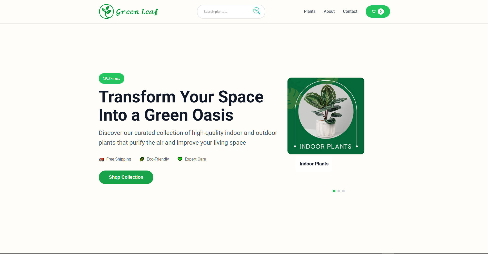
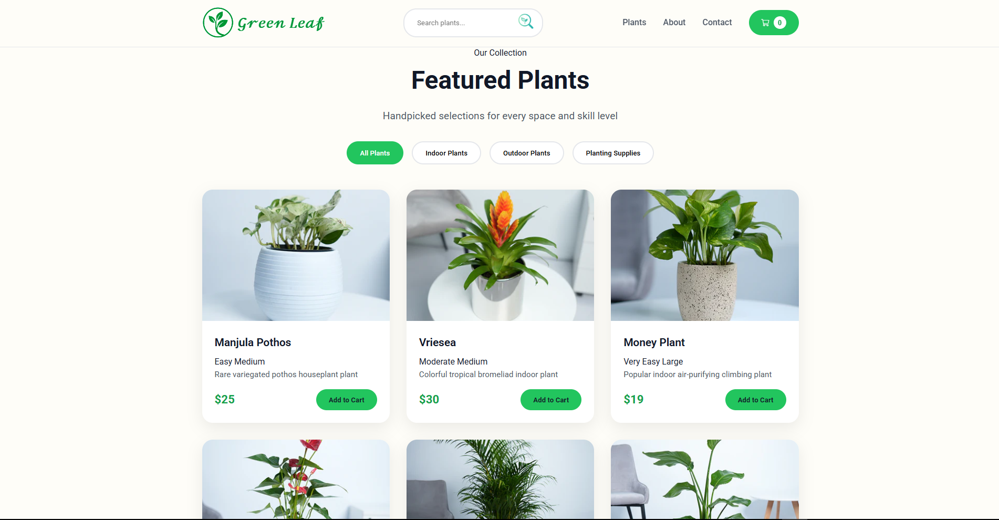
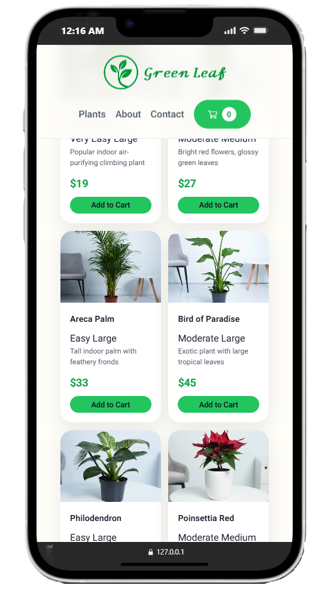
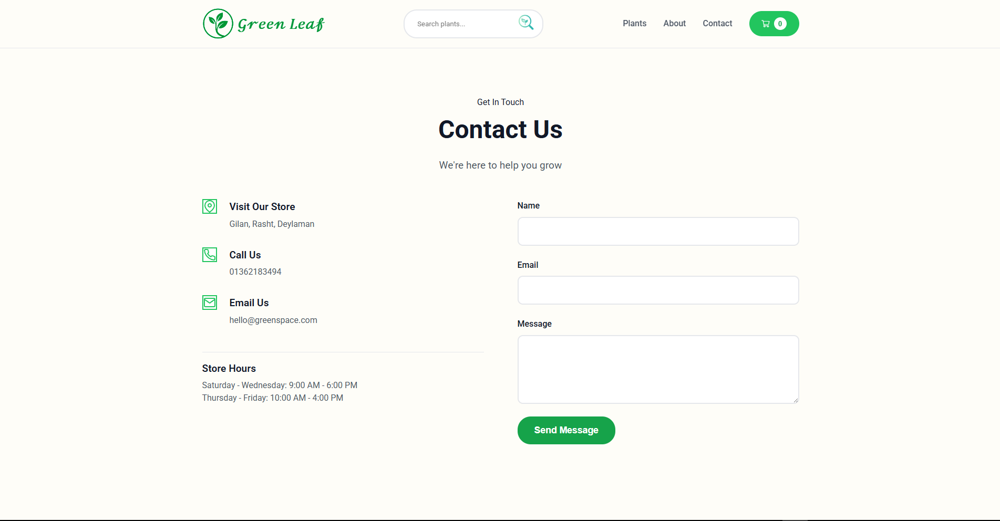

# 🌿 Green Leaf – Your Online Plant Store

[](https://github.com/abolfazl-shadrouh/Green-Leaf/stargazers)
[](https://github.com/abolfazl-shadrouh/Green-Leaf/network)
[](https://github.com/abolfazl-shadrouh/Green-Leaf/blob/main/LICENSE)

**Welcome to Green Leaf!**  
A modern, responsive online store for indoor plants, decorative flowers, and plant care accessories. 🌱  
Bring nature into your home and enjoy a fresh, green, and calming environment.  

---

## ✨ Table of Contents

- [🎯 Features](#-features)  
- [🛠️ Tech Stack](#️️-tech-stack)  
- [📁 Project Structure](#-project-structure)  
- [🚀 Live Demo](#-live-demo)  
- [🔧 Installation & Setup](#-installation--setup)  
- [📷 Screenshots](#-screenshots)  
- [🛠 Future Enhancements](#-future-enhancements)  
- [🧑‍💻 About the Developer](#-about-the-developer)  
- [🔗 Support & Links](#-support--links)  
- [📜 License](#-license)

---

## 🎯 Features

✅ Fully responsive design (mobile, tablet, desktop)  
✅ Elegant & modern user interface  
✅ Interactive product listings with categories 🍀 
✅ Smooth animations and hover effects ✨  
✅ Contact & inquiry form 📝 
✅ SEO-friendly structure  
✅ Clean navigation and easy-to-use layout  

---

## 🛠️ Tech Stack

- **HTML5** for semantic structure  
- **CSS3 / Flexbox / Grid** for layouts & design  
- **JavaScript** for interactivity & dynamic behavior  

---

## 📁 Project Structure

Green-Leaf/

├── assets/ # images, icons, media

├── index.html

├── style.css

├── script.js

├── responsive-design-for-mobile-and-tablets.css

└── README.md

---

## 🔧 Installation & Setup

To run locally:

1. Clone the repo  
   ```bash
   git clone https://github.com/abolfazl-shadrouh/Green-Leaf.git

2. Navigate into folder
  ```bash
git clone cd Green-Leaf
```

3. Open index.html in your browser
  ```bash
git clone open index.html
```

---

## 🚀 Live Demo

🌐 *Add your live website link here (Netlify, GitHub Pages, or other hosting)*  

Example: [https://abolfazl-shadrouh.github.io/Green-Leaf/](#)

---

## 📷 Screenshots

> A visual preview of Green Leaf on desktop and mobile devices.

### 🖥️ Home Page (Desktop)


### 📱 Home Page (Mobile)


---

### 🖥️ Plants / Products Page (Desktop)


### 📱 Plants / Products Page (Mobile)


---

### 🌍 Contact Us


---

## 🛠 Future Enhancements

- Add **backend functionality** (Node.js, Django, or Flask)  
- Database for storing orders, inquiries, and customer info (MySQL / MongoDB)  
- User authentication & account system  
- Online payment integration 💳  
- Multi-language support 🌍 
- Admin dashboard for managing products, orders, and users 👨‍💼  

---

## 🧑‍💻 About the Developer

**Abolfazl Shadrouh**  
Full-Stack Web Developer | Open Source Enthusiast  
Made with ❤️ in Iran

---

## 🔗 Support & Links

If you enjoy my work, please consider supporting me⬇️  

[](https://www.instagram.com/abolfazl_shadrouh)
[](https://github.com/abolfazl-shadrouh)  
[](https://www.shadrouh.ir)

---

## 📜 License

This project is licensed under the **MIT License** ✅  
Feel free to use, modify, and share it with proper credit 🙌
